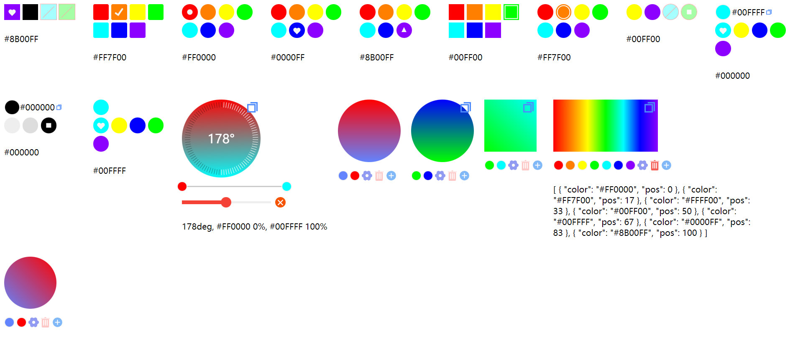

 [](https://www.npmjs.com/package/colorspick)
 
 # Demo - 效果演示
 - colorspick（颜色选择器），支持单色、渐变选择
- 优点:
  - 轻量
  - 简洁
- [Demo](https://yunzhonjun.github.io/colorspick.github.io/)
- 备用地址 - https://yunzhonjun.github.io/colorspick.github.io/
- 参考图

 
 
--- 
  
 
# Start - 下载（install）  
 ```sh
npm i colorspick 
 ```

--- 
 
# Top1-Vue局部使用（推荐）  
```html
<template 
  <colors-pick v-model="color1" />
   {{ color1 }}  

    <colors-pick cp-type='gradc' v-model="color2" >
   {{ color2 }} 
</template>

<script setup>
import { ref } from 'vue'
// 加载css
import 'colorspick/style.css'
// 导入组件
import { ColorsPick } from 'colorspick'
 
const color1 = ref()
const color2 = ref()
</script> 
```

---

# Top2-Vue全局使用 
### 1. main.js全局注册组件
> src/main.js
```js
// src/main.js
import { createApp } from 'vue'
import App from '@/App.vue'

//导入colorspick与css
import 'colorspick/style.css'
import ColorsPick from 'colorspick'


const app = createApp(App); 

//注册ColorsPick
app.use(ColorsPick)

app.mount("#app");
```

### 2. 使用组件
> src/views/Home.vue

```html
<template 
<!-- src/views/Home.vue -->
  <colors-pick square cp-type='gradc' :cp-swat="true" cp-swat-active="yes" v-model="colors" />
   {{ colors }}  
</template>

<script setup>
import { ref } from 'vue' 
const colors = ref() 
</script> 
```
 

---

# 属性 
<<<<<<< HEAD
|<span style="display:inline-block;min-width:120px">属性</span>|<span style="display:inline-block;min-width:100px">类型</span>|<span style="display:inline-block;min-width:100px">默认值</span>|作用|<span style="display:inline-block;min-width:200px">可用模式</span>
=======
|<span style="display:inline-block;min-width:190px">属性</span>|<span style="display:inline-block;min-width:170px">类型</span>|<span style="display:inline-block;min-width:200px">默认值</span>|作用|<span style="display:inline-block;min-width:200px">可用模式</span>|
|<span style="display:inline-block;min-width:120px">属性</span>|<span style="display:inline-block;min-width:170px">类型</span>|<span style="display:inline-block;min-width:100px">默认值</span>|作用|<span style="display:inline-block;min-width:200px">可用模式</span>|
>>>>>>> ae2b66c8a7b183f04e960c92d6dc390bfb3c1a60
|:----|:----|:----|:----|:---:|
|cp-type|String {gradc \| onec \| swate}|默认 onec|gradc(渐变模式)  <br/>  onec(单色模式) <br/>swate(纯色板模式)|   gradc \| swate  \| onec |
|disabled|Boolean|默认 true(颜色可选)|是否可以选择颜色|onec \| gradc|
|toastTime|Number|默认 1000|复制提示显示时间 默认1000毫秒|onec \| gradc|
|copy|Boolean|默认 true(显示)|显示/隐藏复制按钮|onec \| gradc|
|round|Boolean|默认 false|圆形|onec \| gradc \| swate|
|square|Boolean|默认 false |矩形|onec \| gradc \| swate|
|width|[String,Number]|onec模式默认 30px \| gradc模式默认200px|选色器高宽度|onec \| gradc|
|height|[String,Number]|onec模式默认 30px \| gradc模式默认200px|选色器高度|onec \| gradc|
|width|[String,Number]|onec模式默认 30px<br/><br/> gradc模式默认200px|选色器高宽度|onec \| gradc|
|height|[String,Number]|onec模式默认 30px<br/><br/> gradc模式默认 200px|选色器高度|onec \| gradc|
<<<<<<< HEAD
|color|[String,Array]|onec(单色)模式默认 #00FF00（绿色）<br/><br/>gradc(渐变)模式初始颜色 ['#FF0000','#6284FF'] <br/><br/>**注：仅支持6位16进制颜色 如：#ffffff**| 颜色初始值 |onec \| gradc |
=======
|color|[String,Array]|默认 #05b9e6（天蓝色）**注：仅支持6位16进制颜色 如：#ffffff**|onec(单色)模式初始颜色 #05b9e6 <br/><br/> gradc(渐变)模式初始颜色 ['#FF0000','#6284FF'] |onec \| gradc |
>>>>>>> ae2b66c8a7b183f04e960c92d6dc390bfb3c1a60
|grad-range-width|Number|默认 200 |滑块宽度 (单位：px)|gradc|
|grad-range-height|String|默认 2px |滑块高度|gradc|
|grad-range-color| String |默认 #cbcbcb|滑块颜色|gradc|
|grad-color-num| Number{2-99} |默认 99|渐变颜色数量 ,默认2，最低为2 。若低于2、高于99都视为2|gradc|
|grad-icon-size|Number|默认 15|图标大小 (单位：px)|gradc |
|grad-dash-size|Number|默认 70|仪表盘大小 (单位：px)|gradc |
|grad-dash-line-height|Number|默认 10|仪表盘数目长度|gradc |
|grad-dash-color|String|默认rgba(0,0,0,.4)|仪表盘初始颜色|gradc|
|grad-dash-active-color|String| 默认 #fff|仪表盘激活颜色 |gradc|
|grad-color-rotate|Number{0-360}|默认 90|渐变色初始旋转角度 (单位: deg)|gradc |
|grad-res-data | String  | 默认 all |gradc(渐变)模式返回的数据类型<br/><br/>all-返回所有类型(返回类型：Object)<br/><br/>gradarr-返回渐变信息(返回类型：Aarray)<br/><br/>gradinfo-返回渐变信息(返回类型：String)<br/><br/>bgcss-返回渐变背景css(返回类型：String)<br/><br/>txtcss-返回文本渐变css(返回类型：String)<br/><br/>**注：**`有些返回的数据类型是Object`，但复制到粘贴板的是字符串|gradc|
|cp-border| String |默认`cp-border='2px #f4f4f4'`|边框样式 例如：` cp-border="0"-> 无边框 cp-border="5px #000" -> 5px颜色为#000的边框`|onec \| gradc \| swate|
|cp-swat|Boolear|默认false 关闭|开/关色板|onec|
|cp-swat-colors|Array|默认['#FF0000', '#FF7F00', '#FFFF00', '#00FF00', '#00FFFF', '#0000FF', '#8B00FF'] <br/><br/> **注意**：onec(单色)模式仅支持数组，如：`:cp-swat-colors=['#FF0000', '#FF7F00', '#FFFF00']` <br/><br/> swat(纯色板)模式支持数组对象或纯数组，例1`:cp-swat-colors=['#FF0000', '#FF7F00', '#FFFF00']` <br/><br/>例2 `:swate-colors=[{color:'#FFFF00',disabled:true},'#8B00FF',{color:'#00FF00',disabled:false},{color:'#00FFFF',disabled:false}]`color表示颜色值（仅支持16位6进制颜色，如`#ffffff`）， disabled表示色块是否可选|色板初始颜色|onec \| swate|
|cp-swat-width|String|默认150px|色板宽度 (设置宽度，超出时自动换行) | onec \| swate 
| cp-swat-active|String|默认 love|色板选中类型 circle(圆) square(矩形) goly(三角) love(爱心) yes（勾勾） border（边框）|onec  \| swate|
|cp-swat-gap|String| 默认 5px|色板间距 例如: `cp-swat-gap='2px 5px'` 表示水平间距2px，垂直间距5px  \| 又例：`cp-swat-gap='2px'`垂直间距与水平间距2px|onec \| swate|
|cp-swat-size|String|默认 30px|色板的色块大小 |onec  \| swate|
<<<<<<< HEAD
|cp-swat-active-index|Number|默认 0|色块初始激活的颜色数组下标  |  swate|
|z-index|Number|默认 1| 复制成功提示z-index属性值 |onec  \| gradc|
|cp-evs|String{input, change}|默认 input | v-model的触发时机 | onec 
 
=======
|cp-swat-active-index|Number|默认 0|色块初始激活的颜色数组下标  |onec  \| swate|
|z-index|Number|默认 1| 复制成功提示z-index属性值 |onec  \| gradc|
|cp-evs|String{input, change}|默认 input | 颜色返回时机 | onec \| swate 
|cp-swat-width|String|默认150px|色板宽度 (设置宽度，超出时自动换行) |onec  \|swate|
| cp-swat-active|String|默认 love|色板选中类型 circle(圆) square(矩形) goly(三角) love(爱心) yes（勾勾） border（边框）|onec  \| swate|
|cp-swat-gap|String| 默认 5px|色板间距 例如: `cp-swat-gap='2px 5px'` 表示水平间距2px，垂直间距5px  <br/><br/>  又例：`cp-swat-gap='2px'`垂直间距与水平间距2px|onec \| swate|
|cp-swat-size|String|默认 30px|色板的色块大小 |onec  \| swate|
|cp-swat-active-index|Number|默认 0|色块初始激活的颜色数组下标  |onec  \| swate|
|z-index|Number|默认 1| 复制成功提示z-index属性值 |onec  \| gradc|
|cp-evs|String{input, change}|默认 input | 颜色返回时机 | onec \| swate |

>>>>>>> ae2b66c8a7b183f04e960c92d6dc390bfb3c1a60
---

# solt - 插槽
|名称|作用|可用模式|
|:----|:----|:----|
|copy|复制按钮|gradc\|onec|
|copy-tip|复制提示|gradc\|onec|
|grad-setting|渐变色设置按钮|gradc|
|grad-add|渐变色添加按钮|gradc|
|grad-del|渐变色删除按钮|gradc|

---

# Event - 事件 
|名称|作用|可用模式|
|:-----|:-----|:-----|
|v-model|绑定的16进制颜色|gradc \| onec \| swate | 
<<<<<<< HEAD
|change|input颜色选择的change事件|onec
|input|input颜色选择的change事件|onec
=======
>>>>>>> ae2b66c8a7b183f04e960c92d6dc390bfb3c1a60

 
 # 反馈
## 1. 渐变色色板不可用?
答：色板仅支持单色模式(onec)与纯色板模式(swate)

答：色板仅支持单色模式(onec)与纯色板模式(swate)


# bug、建议、样式、优化提交
 联系QQ **848862551**


[Git](https://github.com/YunZhonJun/colorspick)-https://github.com/YunZhonJun/colorspick
---
End 

2023/4/21 10:30 辑

---
